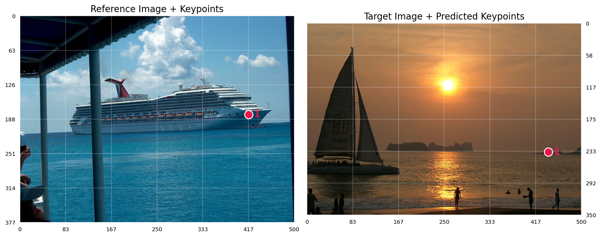
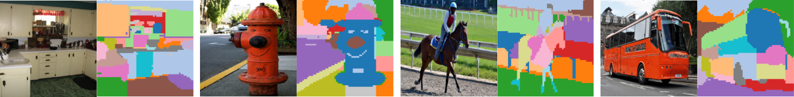
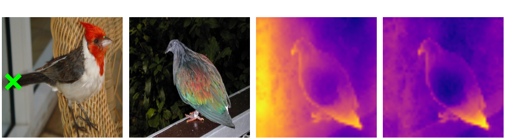
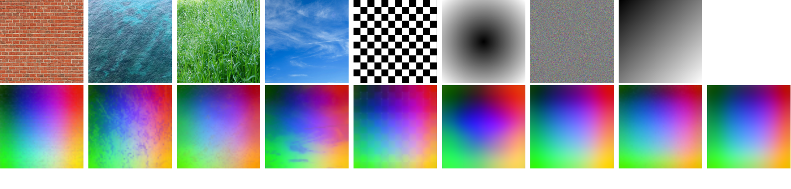

<div align="center">

# INSID3: Training-Free In-Context Segmentation with DINOv3

<p align="center">
  <a href="https://arxiv.org/abs/2603.28480"></a>
  <a href="https://visinf.github.io/INSID3/"></a>
  <a href="https://colab.research.google.com/drive/1zCEqTS6lIbfaV3peNO5-m3U3FC8N2wNk?usp=sharing"></a>
</p>

✨ **CVPR 2026 Oral** ✨


**[Claudia Cuttano](https://scholar.google.com/citations?user=W7lNKNsAAAAJ)<sup>1,2</sup> ·
[Gabriele Trivigno](https://scholar.google.com/citations?user=JXf_iToAAAAJ)<sup>1</sup> ·
[Christoph Reich](https://christophreich1996.github.io)<sup>2,3,5,6</sup> ·
[Daniel Cremers](https://scholar.google.com/citations?user=cXQciMEAAAAJ&hl=en)<sup>3,5,6</sup> ·
[Carlo Masone](https://scholar.google.com/citations?user=cM3Iz_4AAAAJ)<sup>1</sup> ·
[Stefan Roth](https://scholar.google.com/citations?user=0yDoR0AAAAAJ&hl=en)<sup>2,4,5</sup>**

<sup>1</sup> Politecnico di Torino &nbsp;&nbsp; 
<sup>2</sup> TU Darmstadt &nbsp;&nbsp; 
<sup>3</sup> TU Munich &nbsp;&nbsp; 
<sup>4</sup> hessian.AI &nbsp;&nbsp; 
<sup>5</sup> ELIZA &nbsp;&nbsp; 
<sup>6</sup> MCML  


</div>

INSID3 solves in-context segmentation entirely within a single frozen DINOv3 backbone:

🚀 **Training-free:** no fine-tuning, no segmentation decoder, no auxiliary models   
🔍 **Insight:** we uncover and fix a positional bias in DINOv3 features, improving their reliability beyond segmentation  
📈 **State-of-the-art, smaller & faster:** outperforms both training-free and specialized methods while using a single backbone  
🌍 **Generalizes broadly:** from object-level to part-level and personalized segmentation, across natural, medical, underwater, and aerial domains  

<p align="center">
  
</p>

## 🔥 News

- **[2026/04/21]** Added support for Semantic Correspondence inference.
- **[2026/04/16]** Released the [Colab demo](https://colab.research.google.com/drive/1zCEqTS6lIbfaV3peNO5-m3U3FC8N2wNk?usp=sharing) to try INSID3 on your own images.
- **[2026/04/09]** INSID3 is selected for Oral presentation at CVPR 2026.
- **[2026/03/29]** Paper and code are released.

## ⚙️ Environment Setup

INSID3 can be set up either with **Conda** or with **uv**. Choose one of the following options.

### Option 1: Conda

To get started, create a Conda environment and install the required dependencies. The experiments in the paper were run with **PyTorch 2.7.1 (CUDA 12.6)**, which we provide as a reference configuration.

To set up the environment using Conda, run:

```bash
conda create --name insid3 python=3.10 -y
conda activate insid3
pip install -r requirements.txt
```

**Optional:** If you want to use CRF-based mask refinement, also install:
```bash
git clone https://github.com/netw0rkf10w/CRF.git
cd CRF
python setup.py install
cd ..
```

### Option 2: uv
As an alternative to Conda, you can use [`uv`](https://docs.astral.sh/uv/#highlights), a fast Python package and environment manager. In this setup, the optional CRF dependency is already included.

On macOS and Linux:
```bash
curl -LsSf https://astral.sh/uv/install.sh | sh
```

Then run:

```bash
# Ensure CUDA 12.6 is loaded beforehand
# This will automatically create a virtual environment (.venv) and install dependencies from pyproject.toml
uv sync
source .venv/bin/activate
```

## 🧱 DINOv3 Weights

INSID3 relies on a **frozen DINOv3 backbone**. Please download the pretrained weights from the official repository: 👉 https://github.com/facebookresearch/dinov3

Create the ```pretrain``` directory:

```bash
mkdir -p pretrain
```

Place the weights of the backbone you want to use in the ```pretrain/``` folder:

```
pretrain/dinov3_vitl16_pretrain_lvd1689m-8aa4cbdd.pth
pretrain/dinov3_vitb16_pretrain_lvd1689m-73cec8be.pth
pretrain/dinov3_vits16_pretrain_lvd1689m-08c60483.pth
```
By default, we use the Large model (```dinov3_vitl16_pretrain_lvd1689m-8aa4cbdd.pth```). 


## 📍 Minimal Usage

Here is a minimal example to segment a target image given a reference image and its mask. You can also try MARCO directly in our [Colab Demo](https://colab.research.google.com/drive/1zCEqTS6lIbfaV3peNO5-m3U3FC8N2wNk?usp=sharing) on your own images ✨

```python
from models import build_insid3
from utils.visualization import visualize_prediction_segmentation as visualize
 
ref_image_path, ref_mask_path = "assets/ref_cat_image.jpg", "assets/ref_cat_mask.png"
target_image_path = "assets/target_cat_image.jpg"
output_path = "target_cat_pred.png"

# Build model
model = build_insid3()

# Set reference and target
model.set_reference(ref_image_path, ref_mask_path)
model.set_target(target_image_path)

# Predict
pred_mask = model.segment() 

# Save visualization
visualize(
  ref_image_path,
  ref_mask_path,
  target_image_path,
  pred_mask,
  output_path,
)
```

To refine the predicted mask with CRF, initialize the model with: `model = build_insid3(mask_refiner="crf")`.  
For faster inference, reduce the input image size (default is `1024`): a smaller value substantially increases speed with a minor performance drop, e.g. `model = build_insid3(image_size=768)`.

## 📦 Data

Please refer to [docs/data.md](docs/data.md) for dataset preparation instructions.

## 🚀 In-Context Segmentation

Evaluate INSID3:

```bash
python inference_segmentation.py --dataset coco --exp-name insid3-coco
```

#### Main arguments:

- `--dataset`: supported [`coco`, `lvis`, `pascal_part`, `paco_part`, `isaid`, `isic`, `lung`, `suim`, `permis`]
- `--model-size`: DINOv3 backbone size (`small`, `base`, `large`, default: `large`)
- `--shots`: number of reference images per episode (e.g., 1-shot, 5-shot, default: 1)
- `--image-size`: input image resolution (default: `1024`). Reducing it can substantially speed up inference with minimal drop in performance (e.g., `--image-size 768`)

- Other args: hyperparameters (e.g., `--tau`, `--merge-thresh`, `--svd-comps`) have default values as in the paper; pass them to override the defaults. See `opts.py`.


**Note:** By default, the predicted mask is upsampled to the original image resolution using **bilinear interpolation**. For additional refinement, enable **CRF-based refinement** with `--crf-mask-refinement`.
 
## 🧹 Semantic Correspondence

We also analyze the effect of our positional debiasing on **semantic correspondence** using **SPair-71k**. 


<table>
  <thead>
    <tr>
      <th align="left">Version</th>
      <th align="center">PCK@0.05</th>
      <th align="center">PCK@0.10</th>
      <th align="center">PCK@0.15</th>
      <th align="center">PCK@0.20</th>
    </tr>
  </thead>
  <tbody>
    <tr>
      <td align="left">DINOv3-Base-original</td>
      <td align="center">30.1</td>
      <td align="center">46.8</td>
      <td align="center">55.6</td>
      <td align="center">61.2</td>
    </tr>
    <tr>
      <td align="left">DINOv3-Base-debiased</td>
      <td align="center">33.7</td>
      <td align="center">52.6</td>
      <td align="center">62.5</td>
      <td align="center">68.7</td>
    </tr>
  </tbody>
</table>

This provides a simple comparison between the original **DINOv3** features and their **debiased** version for cross-image semantic matching.

To compare the original and debiased features, run:

```bash
python inference_keypoint_matching.py --debiased --image-size 768 --model-size base --svd-comps 20
```
Main arguments:  
- `--debiased`: use positionally debiased DINOv3 features
- `--model-size`: DINOv3 backbone size (`small`, `base`, `large`, default: `large`)
- `--svd-comps`: number of SVD components for positional debiasing

You can also try **semantic correspondence on your own images** by providing a reference image, one or more reference points, and a target image:

```python
from models import build_insid3
from utils.visualization import visualize_prediction_matching as visualize
 
ref_image_path = "assets/ref_boat.jpg"
ref_kps = [[417, 180]] 
target_image_path = "assets/target_boat.jpg"
output_path = "target_boat_pred.png"

# Build model
model = build_insid3(model_size='base', svd_components=20)

# Set reference and target
model.set_reference(ref_image_path)
model.set_target(target_image_path)

# Predict
pred_mask = model.match(ref_kps)  

# Save visualization
visualize(
  ref_image_path,
  ref_kps,
  target_image_path,
  pred_mask,
  output_path,
)
```

An example output is shown below:


| Original DINOv3 | Debiased DINOv3 |
|---------|---------|
|  |  |

## 💡 Why INSID3 Works

INSID3 builds on two key observations about DINOv3 features.

(i) **Dense DINOv3 features** naturally induce a **structured decomposition of the scene**. By clustering them, we obtain coherent object- and part-level regions without supervision.

<p align="center">
  
</p>


(ii) Besides semantic matches, DINOv3 also **responds to absolute image position**. Given a patch on the bird’s tail in the reference image, the DINOv3 similarity map activates on (i) the tail in the target image, but also (ii) over the left portion of the image.
<p align="center">
  
</p>

PCA on low-semantic-content images reveals that this effect lives in a stable **low-dimensional subspace**. INSID3 removes it in a training-free way: we identify the positional component of DINOv3 features and project onto its **orthogonal complement**. This suppresses coordinate-driven responses while preserving semantics.

<p align="center">
  
</p>

## Citation

If you find this work useful in your research, please cite:

```bibtex
@inproceedings{cuttano2026insid3,
  title     = {{INSID3}: Training-Free In-Context Segmentation with {DINOv3}},
  author    = {Claudia Cuttano and Gabriele Trivigno and Christoph Reich and Daniel Cremers and Carlo Masone and Stefan Roth},
  booktitle = {Proceedings of the IEEE/CVF Conference on Computer Vision and Pattern Recognition (CVPR)},
  year      = {2026}
}
```

## Acknowledgements

We gratefully acknowledge the contributions of the following open-source projects:

- [DINOv3](https://github.com/facebookresearch/dinov3)
- [Matcher](https://github.com/aim-uofa/Matcher)
